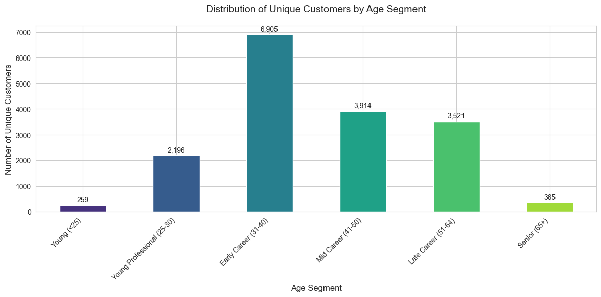
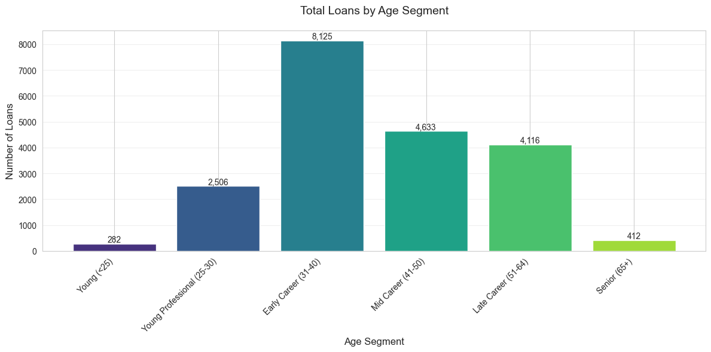
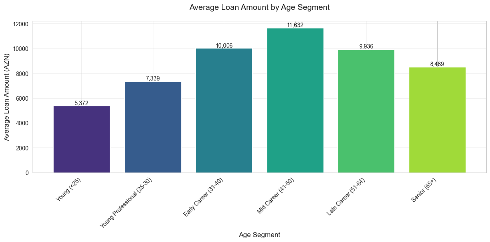
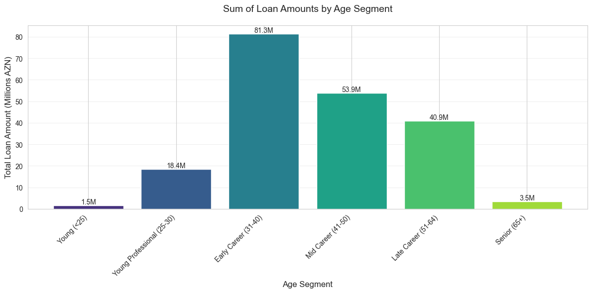

# Yelo Bank Customer Analysis Project
## Data-Driven Product Strategy 2024

## Table of Contents
- [Project Overview](#project-overview)
- [Repository Structure](#repository-structure)
- [Data Analysis](#data-analysis)
- [Customer Segments](#customer-segments)
- [Product Recommendations](#product-recommendations)
- [Installation & Usage](#installation--usage)

## Project Overview
This analysis examines Yelo Bank's loan portfolio data to develop targeted product recommendations. The project includes comprehensive customer segmentation analysis, visualizations, and strategic product suggestions based on customer behavior patterns.

## Repository Structure
```
.
├── DATA_ANALYTICS_EXAM_SQL.XLSX
├── Data Analyst Technical Assignment.ipynb
├── LICENSE
├── README.md
├── charts/
│   ├── average_loan_count.png
│   ├── sum_of_loans.png
│   ├── total_loan_count.png
│   └── unique_customers_count.png
├── loan_data.xlsx
└── requirements.txt
```

## Data Analysis

### Customer Distribution Analysis


Our analysis reveals three primary customer segments:
- Early Career (31-40): 40.2% (6,905 customers)
- Mid Career (41-50): 22.8% (3,914 customers)
- Young Professional (25-30): 12.8% (2,196 customers)

### Loan Behavior Patterns


Loan distribution shows strong correlation with customer segments:
- Early Career segment leads with 8,125 loans (40.5%)
- Mid Career follows with 4,633 loans (23.1%)
- Young Professionals with 2,506 loans (12.5%)

### Financial Analysis



Key financial insights:
- Total portfolio value: 199.5M AZN
- Highest average loan amount: Mid Career (11,632 AZN)
- Largest portfolio share: Early Career (81.3M AZN)

## Customer Segments & Product Recommendations

### 1. Premium Tier: Infinity Credit Card
**Target: Mid Career Professionals (41-50)**
- Demonstrated highest average loan amount (11,632 AZN)
- Strong financial stability (53.9M AZN total volume)
- Low risk profile based on loan performance

**Features:**
- Unlimited cashback
- Global airport lounge access
- Premium travel insurance
- Concierge services
- Metal card design

### 2. Middle Tier: Visa Signature
**Target: Early Career Professionals (31-40)**
- Largest customer base (40.2%)
- Consistent borrowing patterns (81.3M AZN total volume)
- Average loan size: 10,007 AZN

**Features:**
- 2% cashback on all purchases
- Travel rewards program
- Purchase protection
- Extended warranty
- Priority customer service

### 3. Growth Tier: Platinum Card
**Target: Young Professionals (25-30)**
- Growing segment (12.8% of customers)
- Average loan size: 7,339 AZN
- High growth potential

**Features:**
- 1.5% cashback
- 0% intro APR
- No annual fee first year
- Basic travel insurance
- Mobile banking benefits

## Implementation Strategy

### Phase 1: Launch (Q1-Q2 2024)
1. Infinity Card rollout to Mid Career segment
2. Visa Signature introduction to Early Career professionals
3. Platinum Card launch for Young Professionals

### Phase 2: Development (Q3-Q4 2024)
1. Reward program optimization
2. Digital platform enhancement
3. Partnership expansion

### Phase 3: Scale (2025)
1. Product performance analysis
2. Feature enhancement based on usage
3. Market expansion strategy

## Installation & Usage

```bash
# Clone the repository
git clone https://github.com/Ismat-Samadov/yelo_DataAnalyst.git

# Install requirements
pip install -r requirements.txt

# Run Jupyter Notebook
jupyter notebook
```

## Required Dependencies
- pandas
- matplotlib
- seaborn
- numpy
- jupyter

## License
This project is licensed under the terms of the license included in the repository.
